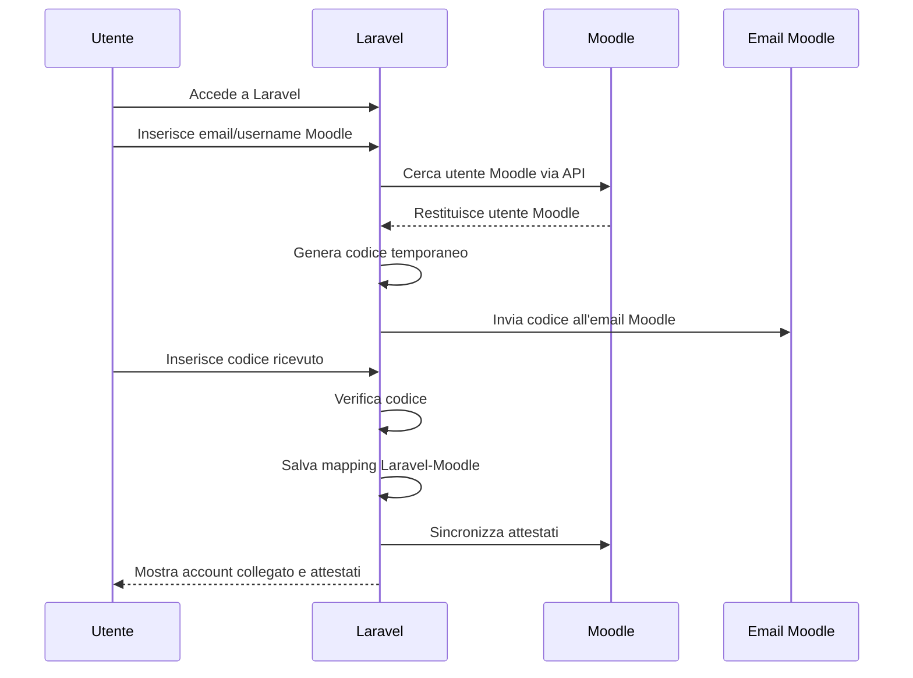

# Piano di implementazione: sync attestati Moodle in Laravel con collegamento via email

## Obiettivo

Implementare nel nuovo applicativo Laravel una funzione che permetta a un utente gia registrato su Laravel di collegare uno o piu account Moodle esistenti, anche se creati in momenti diversi e con email potenzialmente diverse.

Una volta collegato l'account Moodle, Laravel dovra:

- salvare una relazione stabile tra utente Laravel e utente Moodle;
- mantenere il mapping in Laravel senza modificare i dati utente su Moodle;
- sincronizzare in Laravel gli attestati/certificati ottenuti dall'utente nei vari Moodle;
- mostrare nel profilo Laravel l'elenco degli attestati ottenuti, con dati principali e link di verifica/download quando disponibili.

Il piano scelto e il "Piano A": verifica del possesso dell'account Moodle tramite codice inviato all'email registrata su Moodle.

## Principio guida

L'email serve solo per il primo collegamento.

La relazione definitiva non deve essere:

```text
utente Laravel <-> email Moodle
```

ma:

```text
utente Laravel <-> sito Moodle <-> utente Moodle
```

Dopo il primo collegamento, Laravel deve usare il mapping salvato e non dipendere piu dall'email.

## Scenario utente

### Caso di partenza

- L'utente crea un account nel nuovo applicativo Laravel.
- Dopo qualche tempo, l'utente si iscrive autonomamente a uno dei Moodle.
- Il Moodle non conosce ancora l'ID utente Laravel.
- Laravel non conosce ancora l'ID utente Moodle.
- L'email usata su Moodle potrebbe essere diversa da quella usata su Laravel.

### Percorso previsto

1. L'utente accede a Laravel.
2. Entra nella pagina "Collega account Moodle".
3. Sceglie il sito Moodle da collegare.
4. Inserisce l'email o lo username usato su quel Moodle.
5. Laravel cerca l'utente su quel Moodle tramite API.
6. Se trova un solo utente compatibile, genera un codice temporaneo.
7. Laravel invia il codice all'email presente nel profilo Moodle.
8. L'utente legge il codice nella propria casella email.
9. L'utente inserisce il codice in Laravel.
10. Laravel verifica il codice.
11. Laravel salva il collegamento definitivo.
12. Laravel avvia o pianifica la sincronizzazione degli attestati.

## Flusso sintetico



## Dati identificativi

### Identificativo Laravel stabile

Ogni utente Laravel deve avere un identificativo stabile non dipendente dall'email.

Opzioni:

- `users.uuid`
- `users.ulid`
- campo dedicato `external_identity`

Esempio:

```text
laravel_user_uuid = 01JZABC4F7P8K9W2QX6Z0R3YMN
```

Questo valore resta nel database Laravel e viene usato come identificativo interno del nuovo applicativo. Non viene scritto automaticamente in Moodle.

```text
users.uuid = 01JZABC4F7P8K9W2QX6Z0R3YMN
```

### ID Moodle da salvare

Per ogni sito Moodle collegato, Laravel deve salvare almeno:

- ID interno Moodle: `mdl_user.id`
- `idnumber` Moodle, se presente, solo come dato letto e non modificato
- email Moodle al momento del collegamento
- username Moodle al momento del collegamento
- data di collegamento
- stato del collegamento

## Modello dati Laravel proposto

### Tabella `moodle_sites`

Contiene la configurazione dei Moodle collegabili.

Campi suggeriti:

```text
id
name
base_url
api_token_encrypted
certificate_sync_driver
enabled
last_user_sync_at
last_certificate_sync_at
created_at
updated_at
```

Note:

- `api_token_encrypted` deve essere cifrato.
- `base_url` deve essere normalizzato, per esempio `https://moodle.example.com`.
- `certificate_sync_driver` puo essere `native_mod_customcert`, `local_laravelcertsync` o `disabled`.
- ogni Moodle avra il proprio token tecnico.

### Tabella `moodle_user_links`

Contiene il collegamento definitivo tra utente Laravel e utente Moodle.

Campi suggeriti:

```text
id
laravel_user_id
moodle_site_id
moodle_user_id
moodle_idnumber
moodle_username
moodle_email
linked_via
linked_at
last_verified_at
last_certificate_sync_at
status
created_at
updated_at
```

Valori possibili per `linked_via`:

```text
email_code
manual_admin
api_provisioning
```

Valori possibili per `status`:

```text
active
pending
revoked
conflict
```

Vincoli consigliati:

```text
unique(laravel_user_id, moodle_site_id)
unique(moodle_site_id, moodle_user_id)
```

Il primo vincolo evita che lo stesso utente Laravel colleghi due account nello stesso Moodle.

Il secondo vincolo evita che lo stesso account Moodle venga collegato a due utenti Laravel diversi.

### Tabella `moodle_link_attempts`

Contiene i tentativi temporanei di collegamento.

Campi suggeriti:

```text
id
laravel_user_id
moodle_site_id
lookup_type
lookup_value_hash
lookup_value_masked
moodle_user_id
moodle_email_masked
verification_code_hash
expires_at
consumed_at
attempts_count
status
ip_address
user_agent
created_at
updated_at
```

Valori possibili per `lookup_type`:

```text
email
username
```

Valori possibili per `status`:

```text
created
sent
verified
expired
failed
cancelled
```

Note:

- non salvare il codice in chiaro;
- salvare solo hash del codice;
- evitare di salvare email complete se non necessario;
- usare campi mascherati per audit e assistenza, per esempio `m***@example.com`.

### Tabella `user_certificates`

Contiene gli attestati importati dai Moodle.

Campi suggeriti:

```text
id
laravel_user_id
moodle_site_id
moodle_user_id
moodle_customcert_id
moodle_customcert_issue_id
moodle_course_module_id
moodle_context_id
course_id
course_fullname
course_shortname
certificate_name
template_id
template_name
certificate_code
issued_at
expires_at
download_url
verification_url
verification_is_public
pdf_stored_path
raw_payload_json
created_at
updated_at
```

Vincolo consigliato:

```text
unique(moodle_site_id, moodle_customcert_issue_id)
```

Se il plugin Moodle non espone un ID emissione stabile, definire una chiave alternativa:

```text
moodle_site_id + moodle_user_id + course_id + certificate_code
```

## API Moodle necessarie

### Funzioni core

Le funzioni Moodle standard utili sono:

- `core_user_get_users_by_field`
- `core_user_get_users`
- `core_webservice_get_site_info`
- `core_course_get_course_module_by_instance`
- `core_course_get_courses_by_field`

Documentazione Moodle:

- [External Services](https://moodledev.io/docs/5.3/apis/subsystems/external)
- [Writing a new service](https://moodledev.io/docs/5.3/apis/subsystems/external/writing-a-service)
- [Web service API functions](https://docs.moodle.org/dev/Web_service_API_functions)

### Ricerca utente per email

Esempio concettuale:

```text
POST /webservice/rest/server.php

wstoken=TOKEN
wsfunction=core_user_get_users_by_field
moodlewsrestformat=json
field=email
values[0]=utente@example.com
```

### Ricerca utente per username

Esempio concettuale:

```text
POST /webservice/rest/server.php

wstoken=TOKEN
wsfunction=core_user_get_users_by_field
moodlewsrestformat=json
field=username
values[0]=mario.rossi
```

### Endpoint `mod_customcert` esistenti

Dato che gli attestati sono generati dal plugin Moodle `mod_customcert`, la prima verifica tecnica va fatta sul plugin installato in ciascun Moodle.

Nel codice pubblico del plugin `mod_customcert` e presente un endpoint web service utile nelle versioni recenti:

```text
mod_customcert_list_issues
```

Riferimenti:

- codice plugin: https://github.com/mdjnelson/moodle-mod_customcert
- dichiarazione servizi: https://github.com/mdjnelson/moodle-mod_customcert/blob/main/db/services.php
- classe external: https://github.com/mdjnelson/moodle-mod_customcert/blob/main/classes/external.php

Verifica fatta sulle release:

```text
v5.2.2  -> presente
v5.0.4  -> presente
v4.4.10 -> presente
v4.3.5  -> non presente
v4.2.10 -> non presente
```

Quindi non va dato per scontato che esista su tutti i Moodle. In Fase 0 bisogna verificarlo per ogni installazione.

Parametri principali di `mod_customcert_list_issues`:

```text
timecreatedfrom  opzionale, timestamp minimo di emissione
userid           opzionale, ID utente Moodle
customcertid     opzionale, ID istanza customcert
includepdf       opzionale, include PDF base64
limit            opzionale, default 100, massimo 500
offset           opzionale, offset paginazione
```

Esempio chiamata per utente:

```text
POST /webservice/rest/server.php

wstoken=TOKEN
wsfunction=mod_customcert_list_issues
moodlewsrestformat=json
userid=9876
includepdf=0
limit=100
offset=0
```

Esempio chiamata incrementale:

```text
POST /webservice/rest/server.php

wstoken=TOKEN
wsfunction=mod_customcert_list_issues
moodlewsrestformat=json
userid=9876
timecreatedfrom=1761955200
includepdf=0
limit=100
offset=0
```

Campi restituiti dall'endpoint esistente:

```text
issue.id
issue.customcertid
issue.code
issue.emailed
issue.timecreated
user.id
user.fullname
user.username
user.email
template.id
template.name
template.contextid
pdf.name
pdf.content
pdf.haspdf
```

Limiti dell'endpoint esistente:

- richiede la capability `mod/customcert:viewallcertificates` a livello di sistema;
- non e incluso automaticamente nel servizio mobile, quindi va aggiunto a un servizio esterno custom;
- restituisce `template.name`, non necessariamente il nome dell'attivita certificato;
- non restituisce direttamente `course.id`, `course.fullname`, `course.shortname`;
- se `includepdf=1`, il PDF viene codificato in base64 e la risposta puo diventare pesante;
- per usare i dati nel formato ideale per Laravel servono chiamate aggiuntive o una normalizzazione lato Laravel.

Per arricchire i dati usando solo API esistenti, Laravel puo chiamare:

```text
mod_customcert_list_issues
core_course_get_course_module_by_instance
core_course_get_courses_by_field
```

Flusso:

1. `mod_customcert_list_issues` restituisce `issue.customcertid`.
2. Laravel chiama `core_course_get_course_module_by_instance` con:

```text
module=customcert
instance=issue.customcertid
```

3. Da li ricava il course module e il corso.
4. Se serve il nome corso completo, Laravel chiama `core_course_get_courses_by_field`.
5. Laravel mette in cache i dati per `customcertid`, cosi evita chiamate ripetute.

Questa strada e accettabile per un MVP se il volume di attestati e basso o medio.

### Endpoint custom consigliato

Per una integrazione robusta, la soluzione migliore e creare un piccolo plugin locale Moodle read-only, separato da `mod_customcert`, per esempio:

```text
local_laravelcertsync
```

Motivo:

- evita di modificare `mod_customcert`;
- evita fork del plugin originale;
- funziona anche con versioni dove `mod_customcert_list_issues` non esiste;
- restituisce direttamente i campi necessari a Laravel;
- permette una capability dedicata e piu chiara;
- riduce chiamate multiple e logica di arricchimento lato Laravel.

Funzione principale proposta:

```text
local_laravelcertsync_get_user_certificates
```

Parametri:

```text
userid           obbligatorio, ID utente Moodle
timecreatedfrom  opzionale, timestamp minimo di emissione
limit            opzionale, default 100, massimo 500
offset           opzionale
includepdf       opzionale, default false
```

Risposta Laravel-ready:

```text
issue_id
moodle_user_id
customcert_id
certificate_code
issued_at
emailed
certificate_name
template_id
template_name
course_id
course_fullname
course_shortname
cmid
context_id
verification_url
verification_is_public
pdf_name
pdf_base64
has_pdf
```

Query dati base da usare nel plugin:

```sql
SELECT ci.id AS issue_id,
       ci.userid AS moodle_user_id,
       ci.customcertid AS customcert_id,
       ci.code AS certificate_code,
       ci.emailed,
       ci.timecreated AS issued_at,
       c.name AS certificate_name,
       c.verifyany,
       c.templateid,
       ct.name AS template_name,
       co.id AS course_id,
       co.fullname AS course_fullname,
       co.shortname AS course_shortname,
       cm.id AS cmid,
       ctx.id AS context_id
  FROM {customcert_issues} ci
  JOIN {customcert} c ON c.id = ci.customcertid
  JOIN {customcert_templates} ct ON ct.id = c.templateid
  JOIN {course} co ON co.id = c.course
  JOIN {modules} m ON m.name = 'customcert'
  JOIN {course_modules} cm
    ON cm.module = m.id
   AND cm.instance = c.id
   AND cm.course = c.course
  JOIN {context} ctx
    ON ctx.contextlevel = :contextmodule
   AND ctx.instanceid = cm.id
 WHERE ci.userid = :userid
 ORDER BY ci.timecreated ASC, ci.id ASC
```

Parametri base:

```text
userid = ID utente Moodle
contextmodule = CONTEXT_MODULE
```

Se `timecreatedfrom` e valorizzato:

```sql
AND ci.timecreated >= :timecreatedfrom
```

La URL di verifica puo essere costruita cosi:

```text
{MOODLE_BASE_URL}/mod/customcert/verify_certificate.php?contextid={context_id}&code={certificate_code}
```

Nota:

- se `customcert.verifyany = 1`, la verifica puo essere pubblica per quel certificato;
- se `customcert.verifyany = 0`, la verifica puo richiedere login e capability Moodle;
- Laravel deve salvare anche `verification_is_public`, cosi sa se mostrare il link come pubblico o come link Moodle autenticato.

Per il PDF:

- non includere PDF nel sync periodico, salvo necessita esplicita;
- usare `includepdf=false` nel sync standard;
- generare/scaricare il PDF solo on-demand;
- se si usa `mod_customcert_list_issues`, `includepdf=1` puo restituire `pdf.content` base64;
- se si usa `local_laravelcertsync`, aggiungere `includepdf` o una seconda funzione dedicata:

```text
local_laravelcertsync_get_certificate_pdf
```

Parametri suggeriti:

```text
issueid
userid
```

La funzione deve verificare che `issueid` appartenga a `userid` prima di generare il PDF.

## Permessi Moodle richiesti

Per ogni Moodle serve:

- Web Services abilitati;
- protocollo REST abilitato;
- servizio esterno dedicato all'integrazione Laravel;
- utente tecnico associato al servizio;
- token tecnico;
- permessi per leggere utenti;
- permessi per leggere attestati/certificati, direttamente o tramite plugin dedicato.

Se si usa `mod_customcert_list_issues`, l'utente tecnico deve avere:

```text
mod/customcert:viewallcertificates
```

a livello di sistema, perche l'endpoint controlla quella capability su `context_system`.

Se si usa il plugin custom `local_laravelcertsync`, creare invece una capability dedicata:

```text
local/laravelcertsync:view
```

e assegnarla solo al ruolo tecnico usato dal token Laravel.

Separare, se possibile:

- token read-only per lettura utenti;
- token read-only per lettura attestati, se il connettore attestati e separato.

In MVP si puo usare un singolo token tecnico read-only, ma deve essere protetto e limitato il piu possibile.

## Gestione del codice email

### Generazione

Caratteristiche consigliate:

- codice numerico o alfanumerico da 6 a 8 caratteri;
- validita 10-15 minuti;
- massimo 3-5 tentativi;
- un solo codice attivo per utente Laravel, Moodle e lookup;
- invalidazione dei codici precedenti quando se ne genera uno nuovo.

Esempio:

```text
Codice: 482913
Scadenza: 15 minuti
Tentativi massimi: 5
```

### Invio email

L'email va inviata all'indirizzo restituito da Moodle, non all'indirizzo Laravel.

Contenuto minimo:

```text
Oggetto: Codice per collegare il tuo account Moodle

Hai richiesto di collegare questo account Moodle al portale Laravel.
Il tuo codice e: 482913
Il codice scade tra 15 minuti.

Se non hai richiesto tu questa operazione, ignora questa email.
```

Non includere link automatici se non necessari.

### Verifica

Alla verifica:

- recuperare il tentativo pendente;
- controllare scadenza;
- controllare numero tentativi;
- confrontare hash del codice;
- marcare il tentativo come `verified`;
- creare il record in `moodle_user_links`;
- lanciare sync attestati per quel mapping.

## UX prevista in Laravel

### Pagina "I miei Moodle"

Mostrare:

- lista Moodle disponibili;
- stato collegamento per ogni Moodle;
- pulsante "Collega";
- data ultimo sync attestati;
- eventuale messaggio di errore ultimo sync.

Esempio:

```text
Moodle Formazione Interna
Stato: non collegato
[Collega]

Moodle Sicurezza
Stato: collegato come m.rossi
Ultimo sync attestati: 26/06/2026 10:30
[Sincronizza ora]
```

### Form collegamento

Campi:

- sito Moodle;
- email o username Moodle.

Comportamento:

- non mostrare dettagli se l'utente non viene trovato;
- usare messaggio generico;
- se trovato, mostrare email mascherata.

Esempio:

```text
Se i dati corrispondono a un account Moodle, invieremo un codice all'email registrata su Moodle.
```

Dopo invio codice:

```text
Abbiamo inviato un codice a m***@example.com.
Inseriscilo qui per completare il collegamento.
```

### Pagina conferma codice

Campi:

- codice ricevuto;
- pulsante "Conferma";
- pulsante "Invia nuovo codice";
- pulsante "Annulla".

## Sicurezza e privacy

### Evitare user enumeration

Non rispondere mai:

```text
Utente Moodle non trovato.
```

Meglio:

```text
Se i dati corrispondono a un account Moodle, riceverai un codice all'email associata.
```

Questo evita che qualcuno usi Laravel per scoprire quali email sono registrate nei Moodle.

### Rate limit

Applicare rate limit su:

- richieste di ricerca account Moodle;
- invio codici;
- verifica codici;
- tentativi per singolo utente Laravel;
- tentativi per IP;
- tentativi per sito Moodle.

Esempio:

```text
massimo 5 richieste ogni 15 minuti per utente Laravel
massimo 10 richieste ogni 15 minuti per IP
massimo 3 codici attivi/rigenerati ogni ora per Moodle site
```

### Dati personali

Minimizzare i dati salvati:

- salvare email Moodle nel mapping definitivo solo se utile;
- mascherare email nei tentativi;
- salvare hash dei lookup dove possibile;
- cifrare token Moodle;
- loggare errori tecnici senza codici, token o dati sensibili.

### Conflitti

Se un account Moodle risulta gia collegato a un altro utente Laravel:

- non creare un secondo mapping;
- marcare il tentativo come `conflict`;
- mostrare messaggio generico;
- inviare il caso ad amministratore.

Messaggio utente:

```text
Non e stato possibile completare il collegamento automaticamente. Contatta l'assistenza.
```

## Sync attestati dopo il collegamento

Il collegamento account e separato dal sync attestati.

Dopo la verifica codice:

1. Laravel crea o aggiorna `moodle_user_links`.
2. Laravel dispatcha un job:

```text
SyncMoodleCertificatesForUser
```

3. Il job chiama il Moodle e importa gli attestati.
4. Laravel mostra gli attestati nel profilo utente.

## Dati attestato da importare

Campi minimi:

- sito Moodle origine;
- ID utente Moodle;
- ID emissione `customcert_issues.id`;
- ID istanza `customcert.id`;
- ID corso Moodle;
- ID course module Moodle;
- ID context Moodle;
- nome corso;
- shortname corso;
- nome attestato;
- nome template, se utile;
- codice attestato, se disponibile;
- data emissione;
- data scadenza, se disponibile;
- link verifica, se disponibile;
- flag verifica pubblica;
- link download PDF o endpoint download on-demand, se disponibile.

## Specifica attestati `mod_customcert`

Il plugin attestati usato nei Moodle e `mod_customcert`.

La tabella principale delle emissioni e:

```text
customcert_issues
```

Campi rilevanti:

```text
id              ID emissione attestato
userid          ID utente Moodle
customcertid    ID istanza customcert
code            codice attestato
emailed         flag invio email
timecreated     timestamp emissione
```

La tabella dell'attivita certificato e:

```text
customcert
```

Campi rilevanti:

```text
id
course
templateid
name
verifyany
```

Per ottenere dati completi servono anche:

```text
course
course_modules
context
customcert_templates
```

### Strategia consigliata

Usare questa priorita:

1. verificare se il Moodle espone `mod_customcert_list_issues`;
2. se esiste e i dati bastano, usarlo per MVP;
3. se servono dati completi e stabili, installare `local_laravelcertsync`;
4. evitare modifiche dirette a `mod_customcert`;
5. evitare accesso diretto al database Moodle da Laravel.

### Opzione A: usare `mod_customcert_list_issues`

Questa e la strada piu veloce se:

- il plugin `mod_customcert` installato include l'endpoint;
- il servizio esterno Moodle puo includere questa funzione;
- si accetta di fare chiamate aggiuntive per ottenere corso e nome attivita;
- il ruolo tecnico puo avere `mod/customcert:viewallcertificates`.

Pro:

- nessun plugin nuovo da installare;
- meno sviluppo Moodle;
- sufficiente per MVP;
- supporta filtro per `userid`;
- supporta paginazione;
- puo includere PDF base64 on-demand.

Contro:

- non esiste in tutte le versioni;
- richiede capability ampia;
- non restituisce direttamente tutti i campi desiderati da Laravel;
- puo obbligare a N chiamate aggiuntive per arricchire i dati;
- se `includepdf=1`, la risposta puo diventare pesante.

Uso consigliato:

```text
sync periodico: includepdf=0
download PDF: includepdf=1 solo on-demand
```

### Opzione B: creare `local_laravelcertsync`

Questa e la strada piu pulita se il progetto deve funzionare su piu Moodle e restare stabile nel tempo.

Il plugin deve essere:

- locale Moodle: `local/laravelcertsync`;
- read-only;
- senza UI obbligatoria;
- con web service dedicati;
- con capability dedicata;
- senza modificare `mod_customcert`;
- senza modificare utenti Moodle;
- senza scrivere su `customcert_issues`.

Funzioni minime:

```text
local_laravelcertsync_get_user_certificates
```

Funzione opzionale:

```text
local_laravelcertsync_get_certificate_pdf
```

Vantaggi:

- Laravel riceve gia dati completi;
- il contratto API e nostro;
- la query e una sola;
- i permessi sono piu chiari;
- si evita di dipendere da differenze tra versioni `mod_customcert`;
- si puo mantenere lo stesso payload su tutti i Moodle.

### Struttura plugin Moodle proposta

```text
local/laravelcertsync/
  version.php
  db/
    access.php
    services.php
  classes/
    external/
      get_user_certificates.php
      get_certificate_pdf.php
  lang/
    en/
      local_laravelcertsync.php
```

### `db/access.php`

Capability proposta:

```php
<?php
defined('MOODLE_INTERNAL') || die();

$capabilities = [
    'local/laravelcertsync:view' => [
        'captype' => 'read',
        'contextlevel' => CONTEXT_SYSTEM,
        'archetypes' => [],
    ],
];
```

### `db/services.php`

Servizio e funzioni:

```php
<?php
defined('MOODLE_INTERNAL') || die();

$functions = [
    'local_laravelcertsync_get_user_certificates' => [
        'classname' => 'local_laravelcertsync\\external\\get_user_certificates',
        'description' => 'Returns mod_customcert certificates issued to a Moodle user.',
        'type' => 'read',
        'capabilities' => 'local/laravelcertsync:view',
        'ajax' => false,
    ],
    'local_laravelcertsync_get_certificate_pdf' => [
        'classname' => 'local_laravelcertsync\\external\\get_certificate_pdf',
        'description' => 'Returns one issued customcert PDF as base64.',
        'type' => 'read',
        'capabilities' => 'local/laravelcertsync:view',
        'ajax' => false,
    ],
];

$services = [
    'Laravel certificate sync' => [
        'functions' => [
            'local_laravelcertsync_get_user_certificates',
            'local_laravelcertsync_get_certificate_pdf',
        ],
        'restrictedusers' => 1,
        'enabled' => 1,
        'shortname' => 'laravelcertsync',
        'downloadfiles' => 0,
        'uploadfiles' => 0,
    ],
];
```

### `get_user_certificates` contract

Parametri:

```text
userid           required int
timecreatedfrom  optional int
limit            optional int, default 100, max 500
offset           optional int, default 0
includepdf       optional bool, default false
```

Validazioni:

- chiamare `self::validate_parameters`;
- validare `context_system`;
- richiedere `local/laravelcertsync:view`;
- verificare che l'utente Moodle esista e non sia deleted;
- limitare `limit` a massimo 500;
- usare sempre query parametrizzate;
- non restituire utenti diversi da `userid`.

Payload:

```text
[
  {
    "issue_id": 123,
    "moodle_user_id": 9876,
    "customcert_id": 55,
    "certificate_code": "ABC123",
    "issued_at": 1761955200,
    "emailed": false,
    "certificate_name": "Attestato sicurezza base",
    "template_id": 8,
    "template_name": "Template sicurezza",
    "course_id": 22,
    "course_fullname": "Corso sicurezza base",
    "course_shortname": "SIC-BASE",
    "cmid": 345,
    "context_id": 998,
    "verification_url": "https://moodle.example.com/mod/customcert/verify_certificate.php?contextid=998&code=ABC123",
    "verification_is_public": true,
    "pdf_name": null,
    "pdf_base64": null,
    "has_pdf": false
  }
]
```

### `get_certificate_pdf` contract

Parametri:

```text
userid   required int
issueid  required int
```

Validazioni:

- l'issue deve esistere;
- `customcert_issues.userid` deve essere uguale al parametro `userid`;
- la funzione deve essere read-only;
- la risposta deve contenere un solo PDF base64;
- se la generazione PDF fallisce, restituire errore controllato.

Uso:

- chiamarla solo quando l'utente Laravel clicca "Scarica PDF";
- non usarla nel sync schedulato;
- salvare eventualmente il PDF in Laravel solo se richiesto da policy aziendale.

## Componenti Laravel da sviluppare

### Configurazione

- model `MoodleSite`;
- pannello admin per aggiungere/modificare Moodle;
- salvataggio token cifrato;
- test connessione API.

### Client Moodle

Classe dedicata:

```text
MoodleApiClient
```

Metodi suggeriti:

```text
getUserByEmail(string $email)
getUserByUsername(string $username)
getCertificatesForUser(int $moodleUserId)
getCustomcertIssuesForUser(int $moodleUserId, ?int $timecreatedFrom, int $limit, int $offset)
getCourseModuleByCustomcertInstance(int $customcertId)
getUserCertificatesViaLocalPlugin(int $moodleUserId, ?int $timecreatedFrom, int $limit, int $offset)
getCertificatePdf(int $moodleUserId, int $issueId)
```

Il client deve supportare due driver certificati:

```text
native_mod_customcert
local_laravelcertsync
```

Il driver si salva su `moodle_sites.certificate_sync_driver`.

Valori consigliati:

```text
native_mod_customcert
local_laravelcertsync
disabled
```

### Collegamento account

Controller o action:

```text
MoodleAccountLinkController
```

Azioni:

```text
showSites()
startLink()
verifyCode()
resendCode()
cancelAttempt()
unlink()
```

### Job

Job suggeriti:

```text
SendMoodleLinkCodeEmail
SyncMoodleCertificatesForUser
SyncMoodleCertificatesForSite
```

### Mail

Mailable:

```text
MoodleAccountLinkCodeMail
```

### Policy e permessi

Controllare che:

- solo l'utente autenticato possa avviare collegamenti per se stesso;
- solo admin possa vedere tentativi falliti e conflitti;
- solo admin possa scollegare forzatamente account Moodle collegati.

## Fasi di implementazione

### Fase 0: verifica preliminare

Obiettivo: confermare che ogni Moodle possa essere interrogato da Laravel.

Attivita:

- censire tutti i siti Moodle;
- verificare versione Moodle;
- verificare versione installata di `mod_customcert`;
- verificare protocollo REST;
- creare servizio esterno;
- creare utente tecnico;
- generare token;
- testare chiamata a `core_webservice_get_site_info`;
- testare ricerca utente con `core_user_get_users_by_field`;
- verificare se il servizio espone `mod_customcert_list_issues`;
- verificare se e installato `local_laravelcertsync`;
- decidere il driver certificati per ogni Moodle;
- verificare quali campi utente Moodle vengono restituiti dalle API.

Output:

- lista Moodle integrabili;
- lista token configurati;
- conferma permessi lettura utenti;
- conferma disponibilita dei dati necessari al mapping.
- driver certificati scelto per ogni Moodle.

### Fase 1: modello dati Laravel

Obiettivo: predisporre le strutture per siti Moodle, tentativi e mapping.

Attivita:

- creare migration `moodle_sites`;
- creare migration `moodle_user_links`;
- creare migration `moodle_link_attempts`;
- creare migration `user_certificates`;
- aggiungere UUID/ULID stabile agli utenti Laravel se non esiste;
- aggiungere model Eloquent;
- aggiungere relazioni tra model.

Output:

- database pronto;
- vincoli univoci attivi;
- token Moodle salvati cifrati.

### Fase 2: client API Moodle

Obiettivo: centralizzare le chiamate verso Moodle.

Attivita:

- implementare `MoodleApiClient`;
- gestire endpoint REST;
- gestire token per sito Moodle;
- normalizzare errori Moodle;
- implementare ricerca utente per email;
- implementare ricerca utente per username;
- implementare driver `native_mod_customcert`;
- implementare driver `local_laravelcertsync`;
- implementare paginazione con `limit` e `offset`;
- implementare sync incrementale con `timecreatedfrom`;
- implementare cache dati corso/attivita per `customcertid` quando si usa il driver nativo;
- aggiungere test di integrazione con Moodle sandbox o mock HTTP.

Output:

- client riutilizzabile;
- test chiamate base;
- gestione errori coerente;
- normalizzazione unica dei certificati indipendente dal driver.

### Fase 3: avvio collegamento account

Obiettivo: permettere all'utente Laravel di richiedere un codice.

Attivita:

- creare pagina "I miei Moodle";
- creare form di collegamento;
- validare input;
- applicare rate limit;
- cercare utente Moodle;
- creare `moodle_link_attempt`;
- generare codice;
- salvare hash codice;
- inviare email all'indirizzo Moodle;
- mostrare email mascherata.

Output:

- utente puo richiedere codice;
- codice inviato all'email Moodle;
- nessuna informazione sensibile esposta.

### Fase 4: conferma codice e creazione mapping

Obiettivo: completare il collegamento dopo verifica.

Attivita:

- creare form verifica codice;
- verificare codice, scadenza e tentativi;
- creare record `moodle_user_links`;
- applicare vincoli anti-duplicato;
- gestire conflitti;
- marcare tentativo come `verified`;
- mostrare account come collegato.

Output:

- mapping stabile creato;
- account visibile come collegato in Laravel.

### Fase 5: sync attestati per utente

Obiettivo: importare attestati dopo collegamento.

Attivita:

- usare `mod_customcert` come sorgente attestati;
- verificare se il Moodle usa driver `native_mod_customcert` o `local_laravelcertsync`;
- con driver nativo, chiamare `mod_customcert_list_issues`;
- con driver nativo, arricchire i dati con `core_course_get_course_module_by_instance` e cache per `customcertid`;
- con driver custom, chiamare `local_laravelcertsync_get_user_certificates`;
- se `mod_customcert_list_issues` non esiste, installare `local_laravelcertsync`;
- implementare job `SyncMoodleCertificatesForUser`;
- usare `moodle_user_links.moodle_user_id` come `userid`;
- usare `last_certificate_sync_at` per `timecreatedfrom`;
- paginare fino a risposta vuota o inferiore al limite;
- normalizzare dati attestato;
- salvare o aggiornare `user_certificates`;
- non scaricare PDF nel sync standard;
- predisporre download PDF on-demand;
- mostrare attestati nel profilo Laravel.

Output:

- attestati dell'utente visibili in Laravel;
- dati corso e nome certificato disponibili in Laravel;
- codice attestato e link verifica disponibili quando presenti;
- sync eseguibile manualmente;
- sync eseguibile via scheduler.

### Fase 6: scheduler e monitoraggio

Obiettivo: mantenere gli attestati aggiornati automaticamente.

Attivita:

- schedulare sync periodico;
- sync per utente collegato;
- sync per sito Moodle;
- retry controllati;
- logging errori;
- dashboard admin per ultimi sync;
- alert su token scaduti o Moodle non raggiungibili.

Output:

- sincronizzazione automatica;
- visibilita sugli errori;
- gestione operativa sostenibile.

## MVP consigliato

Per partire rapidamente:

1. configurare un solo Moodle pilota;
2. implementare `moodle_sites`;
3. implementare collegamento via email;
4. salvare mapping;
5. verificare se il Moodle pilota espone `mod_customcert_list_issues`;
6. se l'endpoint esiste, usare driver `native_mod_customcert` per MVP;
7. se l'endpoint non esiste o i dati non bastano, installare `local_laravelcertsync`;
8. importare attestati `mod_customcert` senza PDF;
9. aggiungere download PDF on-demand;
10. estendere agli altri Moodle dopo validazione.

## Casi limite da gestire

### Email Moodle non accessibile

Soluzione:

- fallback manuale da admin;
- in futuro, aggiungere Piano B alternativo con codice copiato dentro Moodle.

### Utente non trovato

Soluzione:

- messaggio generico;
- log tecnico interno;
- nessuna esposizione pubblica.

### Piu utenti trovati

Con `core_user_get_users_by_field` su campi univoci dovrebbe non succedere per email/username, ma va gestito.

Soluzione:

- non procedere automaticamente;
- stato `conflict`;
- revisione admin.

### Account Moodle gia collegato

Soluzione:

- bloccare nuovo collegamento;
- stato `conflict`;
- richiesta assistenza.

### Utente Laravel prova a collegare account Moodle non suo

La verifica via codice lo blocca, perche il codice arriva all'email dell'account Moodle.

### Moodle non raggiungibile

Soluzione:

- tentativo in stato `failed`;
- retry controllato;
- messaggio utente non tecnico;
- alert admin.

### `mod_customcert_list_issues` non disponibile

Soluzione:

- installare `local_laravelcertsync`;
- impostare `moodle_sites.certificate_sync_driver = local_laravelcertsync`;
- rieseguire test connessione certificati;
- non usare scraping HTML di `my_certificates.php`.

### `mod_customcert_list_issues` disponibile ma dati incompleti

Soluzione:

- per MVP, arricchire lato Laravel con `core_course_get_course_module_by_instance`;
- mettere in cache i dati per `customcertid`;
- se il numero di chiamate cresce troppo, passare a `local_laravelcertsync`.

### Capability `mod/customcert:viewallcertificates` troppo ampia

Soluzione:

- preferire `local_laravelcertsync`;
- creare capability dedicata `local/laravelcertsync:view`;
- mantenere il token riservato al solo servizio Laravel;
- loggare tutte le chiamate lato Laravel.

### PDF troppo pesanti nel sync

Soluzione:

- non usare `includepdf=1` nello scheduler;
- salvare solo metadata e link/verifica;
- generare PDF solo on-demand;
- valutare caching PDF in Laravel solo se serve per performance o conservazione.

## Decisioni aperte prima dello sviluppo

- Laravel ha gia un UUID/ULID stabile per gli utenti?
- Gli utenti potranno collegare un solo account per Moodle o piu account nello stesso Moodle?
- Quali Moodle saranno nel primo pilota?
- Quale versione di `mod_customcert` e installata sul Moodle pilota?
- Il Moodle pilota espone `mod_customcert_list_issues`?
- Il ruolo tecnico puo avere `mod/customcert:viewallcertificates`?
- Vogliamo accettare il driver nativo per MVP o installare subito `local_laravelcertsync`?
- Gli attestati devono essere solo visualizzati o anche scaricati come PDF?
- I PDF devono essere conservati in Laravel o generati on-demand da Moodle?
- Serve scollegare un account Moodle dal profilo Laravel?
- Serve approvazione admin per collegamenti sospetti?

## Definition of Done

La prima versione e completa quando:

- un admin puo configurare almeno un Moodle;
- un utente Laravel puo richiedere il collegamento a un Moodle;
- Laravel invia un codice all'email Moodle;
- l'utente puo confermare il codice;
- Laravel salva il mapping definitivo;
- Laravel impedisce duplicati e conflitti;
- Laravel importa gli attestati dell'utente collegato;
- Laravel importa gli attestati da `mod_customcert`;
- per ogni Moodle e configurato un driver certificati;
- il driver configurato e testato in Fase 0;
- i PDF non vengono scaricati nello scheduler standard;
- l'utente vede gli attestati nel proprio profilo;
- gli errori sono tracciati e visibili agli admin;
- i token Moodle non sono salvati in chiaro.

## Raccomandazione finale

La verifica via email Moodle e la scelta piu semplice per iniziare perche:

- non richiede plugin Moodle per il collegamento account;
- non richiede SSO;
- mantiene Laravel stand-alone;
- e compatibile con piu Moodle;
- consente di arrivare rapidamente a un mapping stabile;
- permette in seguito di aggiungere SSO o plugin Moodle senza rifare il modello dati.

La parte piu delicata non e l'invio del codice, ma la gestione corretta del mapping finale e dei conflitti. Una volta creato il mapping `laravel_user_id + moodle_site_id + moodle_user_id`, la sincronizzazione degli attestati diventa molto piu semplice e affidabile.
